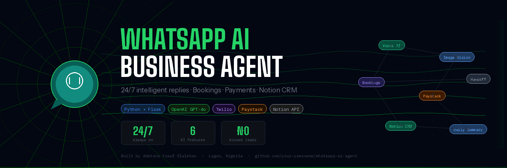

# WhatsApp AI Business Agent

> **Turn any WhatsApp Business number into a 24/7 AI-powered sales and support assistant.**
> Customers get instant intelligent replies. Every lead, booking and conversation is logged to Notion automatically.

---

## What it does

A customer messages your WhatsApp number. The AI replies instantly — answering questions, taking bookings, generating payment links, and logging everything to Notion. The business owner wakes up to a daily summary of every conversation.

No more manually replying the same 10 questions all day.

---

## Features

| Feature | Description |
|---|---|
| **Smart AI replies** | Understands natural language — English and Pidgin |
| **Voice note support** | Customer sends voice → Whisper transcribes it → bot replies |
| **Image recognition** | Customer sends a photo → GPT-4o Vision identifies it → bot suggests services |
| **Appointment booking** | Collects name, service, date, time → saves to Notion automatically |
| **Payment links** | Paystack link auto-generated when booking is confirmed |
| **Human handoff** | Detects frustration or request → notifies owner on WhatsApp instantly |
| **Daily summary** | Every morning at 8am → owner gets a full WhatsApp summary of leads |
| **Notion CRM** | Every customer, conversation and booking logged automatically |

---

## Demo

```
Customer: How much is hair fixing?

Bot: Our hair fixing services (wigs and weaves) range from ₦15,000 to ₦40,000
     depending on the style. Would you like to book an appointment?

Customer: Yes, I want to book. My name is Amaka, Saturday at 2pm.

Bot: Thank you Amaka! Confirming: hair fixing on Saturday at 2:00 PM.
     We look forward to seeing you! Here's your payment link to secure your slot:
     https://checkout.paystack.com/xxxxxx
```

**Behind the scenes — Notion updates automatically:**
- New lead created in WhatsApp Leads database
- New booking confirmed in Bookings database
- Payment link recorded against the customer

---

## Tech stack

- **Python + Flask** — webhook server
- **Twilio** — WhatsApp messaging API
- **OpenAI GPT-4o-mini** — AI reply engine
- **OpenAI Whisper** — voice note transcription
- **OpenAI GPT-4o Vision** — image recognition
- **Paystack** — payment link generation
- **Notion API** — CRM and bookings database
- **APScheduler** — daily summary cron job

---

## Quick start

### 1. Clone the repo
```bash
git clone https://github.com/your-username/whatsapp-ai-agent
cd whatsapp-ai-agent
```

### 2. Create virtual environment
```bash
python -m venv .venv
.venv\Scripts\activate        # Windows
source .venv/bin/activate     # Mac/Linux
```

### 3. Install dependencies
```bash
pip install flask twilio openai notion-client python-dotenv apscheduler requests
```

### 4. Configure environment variables
Create a `.env` file:
```
TWILIO_ACCOUNT_SID=ACxxxxxxxxxxxxxxxxxxxxxxxxxxxxxxxx
TWILIO_AUTH_TOKEN=your_auth_token
TWILIO_WHATSAPP_NUMBER=whatsapp:+14155238886
OPENAI_API_KEY=sk-proj-your_key
NOTION_TOKEN=ntn_your_token
NOTION_LEADS_DB_ID=your_leads_database_id
NOTION_BOOKINGS_DB_ID=your_bookings_database_id
PAYSTACK_SECRET_KEY=sk_test_your_paystack_key
```

### 5. Configure the business profile
Edit `config.py` with your client's details:
```python
BUSINESS_NAME  = "Your Business Name"
BUSINESS_TYPE  = "your business type"
OWNER_WHATSAPP = "whatsapp:+234XXXXXXXXXX"
SERVICES_TEXT  = "list your services and prices here"
HOURS          = "Mon-Sat 8am-7pm"
LOCATION       = "Your address"
```

### 6. Set up Notion databases

**WhatsApp Leads** database fields:
| Field | Type |
|---|---|
| Customer name | Title |
| Phone number | Text |
| Last message | Text |
| Intent | Select (Pricing / Booking / Complaint / General / Handoff) |
| Status | Select (New / Replied / Converted / Cold / Urgent) |
| First contact | Date |
| Summary | Text |

**Bookings** database fields:
| Field | Type |
|---|---|
| Customer name | Title |
| Phone | Text |
| Service | Text |
| Date | Date |
| Time | Text |
| Status | Select (Confirmed / Cancelled / Completed) |

### 7. Connect Notion integration
- Go to `notion.so/profile/integrations` → create integration
- Connect it to both databases via `...` → Connections

### 8. Expose local server
```bash
ngrok http 5000
```
Copy the `https://xxxx.ngrok.io` URL and paste it into Twilio:
Messaging → WhatsApp Sandbox → "When a message comes in" → `https://xxxx.ngrok.io/webhook`

### 9. Run
```bash
python app.py
```

---

## Deploying to production

For a live client deployment, host on any of these instead of running locally:

| Platform | Cost | Notes |
|---|---|---|
| Railway | Free tier | Easiest — push to GitHub and deploy |
| Render | Free tier | Good for always-on Flask apps |
| VPS (DigitalOcean/Contabo) | ~$5/month | Full control, best for multiple clients |

Replace ngrok with your production URL in Twilio settings.

---

## Using a client's existing WhatsApp number

If your client already has a WhatsApp Business number:
1. Sign up at [360dialog.com](https://360dialog.com) as a BSP
2. Migrate the client's number to the WhatsApp Business API
3. Update the webhook URL to point to your server
4. Your `app.py` code stays identical — only the `.env` changes

---

## Customising for a new client

The entire business brain lives in `config.py`. To onboard a new client:
1. Update `config.py` with their business name, services, prices, hours, location
2. Create their two Notion databases
3. Update `.env` with their database IDs
4. Deploy — done

Each client gets their own isolated deployment with their own Notion workspace.

---

## Project structure

```
whatsapp-ai-agent/
├── app.py          # Main Flask server + all 6 features
├── config.py       # Business profile — edit per client
├── .env            # API keys — never commit this
├── .gitignore
└── README.md
```

---

## Built by

**Adetona Yusuf Olalekan**
Lagos, Nigeria

Built as a real product for small businesses across Nigeria who run their entire
customer communication on WhatsApp and need intelligent automation that actually
understands how Nigerians communicate.

---

## Roadmap

- [ ] Multi-language support (Yoruba, Igbo, Hausa)
- [ ] Google Calendar integration for bookings
- [ ] Instagram DM support
- [ ] Web dashboard for business owners
- [ ] WhatsApp broadcast list automation
- [ ] Multi-agent support (one number, multiple AI personalities per department)

---

## License

MIT — free to use, modify and deploy for commercial projects.
